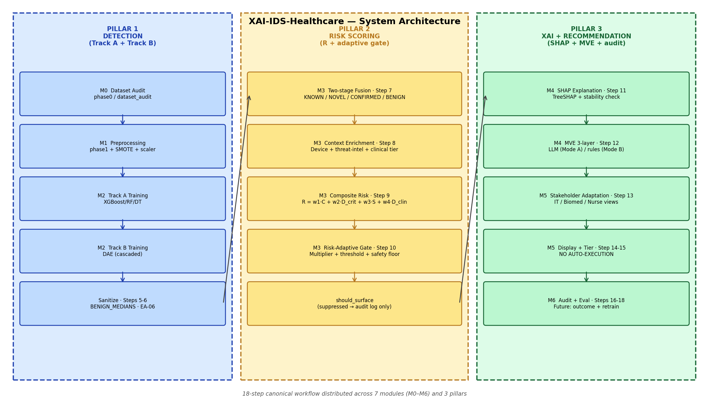
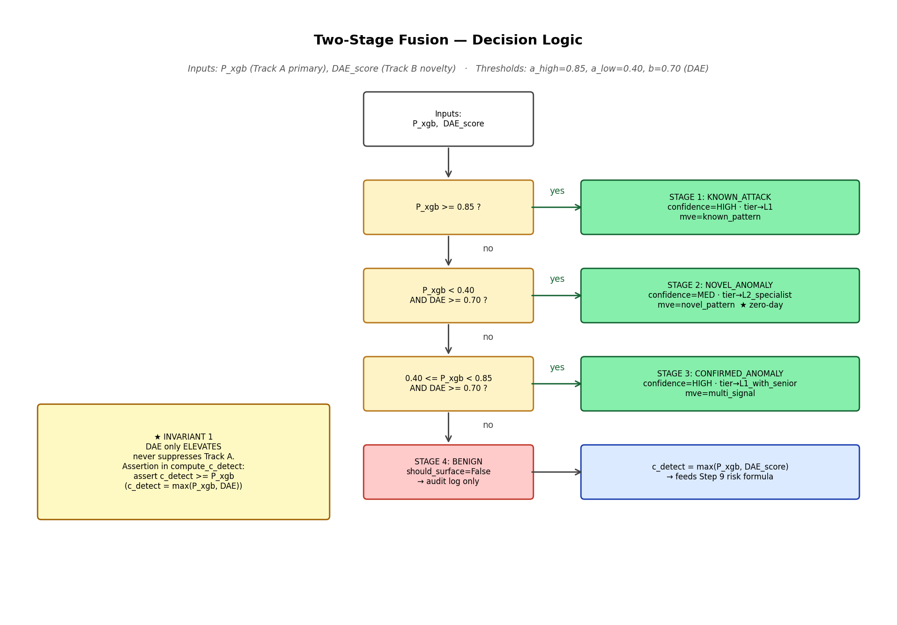

# XAI-IDS-Healthcare — System Architecture

> Foundation document covering all 18 workflow steps. Companion artifacts:
> [`docs/figures/system_architecture.png`](figures/system_architecture.png) ·
> [`docs/figures/data_flow.png`](figures/data_flow.png) ·
> [`docs/figures/two_stage_fusion.png`](figures/two_stage_fusion.png) ·
> [`results/reports/invariant_verification.log`](../results/reports/invariant_verification.log)

Generated: 2026-05-05  ·  Branch: `fix/shap-category-vocab`

---

## 1. Overview

The system is organised as **3 pillars × 7 modules × 18 canonical steps**.



### 1.1 Three pillars

| Pillar | Concern | Modules | Workflow steps |
| --- | --- | --- | --- |
| **P1 — Detection** | Decide *whether* the flow is anomalous | M0, M1, M2 | 1–7 |
| **P2 — Risk Scoring** | Decide *how urgent* the anomaly is in clinical context | M3 | 8–10 |
| **P3 — XAI + Recommendation** | Decide *what the operator should do* | M4, M5, M6 | 11–18 |

### 1.2 Eighteen-step workflow (per ARCHITECTURE.md)

Offline (one-time): **[1]** Data Preparation · **[2]** Track A Training · **[3]** Track B Training · **[4]** Threshold Calibration.

Online (per alert): **[5]** Sanitize · **[6a]** Track A · **[6b]** Track B · **[7]** Two-stage Fusion · **[8]** Context Enrichment · **[9]** Composite Risk · **[10]** Risk-adaptive Gate · **[11]** SHAP Explanation · **[12]** MVE 3-layer · **[13]** Stakeholder Adaptation · **[14]** Display + Tier · **[15]** Response Recommendation · **[16]** Operator Decision Logging · **[17]** Outcome Tracking (future) · **[18]** Continuous Improvement (future).

The full diagrammatic source of truth lives in the **Canonical System Workflow** section of [`ARCHITECTURE.md`](../ARCHITECTURE.md).

### 1.3 Module ↔ workflow map

| Module | Steps owned | Code root |
| --- | --- | --- |
| **M0 — Dataset Audit** | [1] | [`module0_analysis/phase0/`](../module0_analysis/phase0/) |
| **M1 — Preprocessing** | [1] | [`module1_preprocessing/phase1/`](../module1_preprocessing/phase1/) |
| **M2 — Detection Training** | [2], [3], [4] | [`module2_detection/`](../module2_detection/) |
| **M3 — Risk Scoring** | [5]*, [6a], [6b], [7], [8], [9], [10] | [`module3_risk_scoring/`](../module3_risk_scoring/) + [`src/risk_scorer.py`](../src/risk_scorer.py) + [`src/preprocessing.py`](../src/preprocessing.py) |
| **M4 — Explanations** | [11], [12] | [`module4_explanations/`](../module4_explanations/) + [`src/mve_generator.py`](../src/mve_generator.py) |
| **M5 — Responses** | [13], [14], [15] | [`module5_responses/`](../module5_responses/) |
| **M6 — Evaluation** | [16], [17]†, [18]† | [`module6_evaluation/`](../module6_evaluation/) |

\*Step [5] sanitization has both a per-alert path (`src/preprocessing.py`) and a batch path (`module3_risk_scoring/.../_sanitise_features`). †Steps [17]/[18] are documented as future work.

---

## 2. Module Specifications

For each module: **inputs → outputs**, **key functions**, **invariants**.

### 2.1 M0 — Dataset Audit

| Field | Value |
| --- | --- |
| **Inputs** | WUSTL-EHMS-2020 raw CSV (16,318 flows) |
| **Outputs** | `phase0/dataset_audit.yaml` (class balance, missing-value report, feature audit) |
| **Key functions** | `phase0/analyzer.py::analyze_class_balance`, `phase0/quality_report.py` |
| **Invariants** | No PHI leaks into feature names — biometric features (`Heart_rate`, `SpO2`, …) are de-identified per WUSTL release; audit asserts column count == 25 |

### 2.2 M1 — Preprocessing

| Field | Value |
| --- | --- |
| **Inputs** | Raw CSV from M0 |
| **Outputs** | `train_phase1.parquet`, `train_benign_phase1.parquet`, `test_phase1.parquet`, `robust_scaler.pkl`, `selected_features.json`, `data/processed/benign_medians.json` |
| **Key functions** | [`pipeline.py`](../module1_preprocessing/phase1/pipeline.py) (`run`), `splitter.py` (stratified split), `smote.py` (training-set only), `scaler.py` (RobustScaler) |
| **Invariants** | Stratified split by attack/benign label · SMOTE applied to training set only (never to val or test) · Scaler fitted on training set only |

### 2.3 M2 — Detection Training (Pillar 1)

| Field | Value |
| --- | --- |
| **Inputs** | `train_phase1.parquet` (Track A), `train_benign_phase1.parquet` (Track B) |
| **Outputs** | Track A: `xgboost_final_pipeline.pkl`, `random_forest_final_pipeline.pkl`, `decision_tree_final_pipeline.pkl` + per-model `*_final_report.json` + OOF probas. Track B: `dae_detector.json` + `dae_model.weights.h5` + `dae_final_report.json`. |
| **Key functions** | [`module2_train_models.py::train_track_a`](../module2_detection/module2_train_models.py), `::train_track_b_dae`, [`models/_threshold.py::find_optimal_threshold`](../module2_detection/models/_threshold.py) |
| **Invariants** | XGBoost selected as primary (best F1=0.892, AUC=0.994; rationale in `detection_baseline.yaml`) · DAE input is **cascaded**: `[25 raw \|\| P_xgb, P_rf, P_dt]` (28-dim) · DAE trained on benign-only |

### 2.4 M3 — Risk Scoring (Pillar 2)

| Field | Value |
| --- | --- |
| **Inputs** | Sanitized 25-feature vector + Track A/B outputs from M2 + device context from `tests/fixtures/device_inventory.yaml` |
| **Outputs** | `ScoredAlert` (`adjusted_score`, `threshold`, `should_surface`, `risk_multiplier`, `suppression_reason`, `fusion_class`, `data_quality`); batch artefacts `risk_scores.npz`, `risk_report.json`, `risk_scores_detail.csv` |
| **Key functions** | [`compute_c_detect`](../module3_risk_scoring/module3_risk_scores.py) · [`classify_fusion`](../module3_risk_scoring/module3_risk_scores.py) · [`compute_d_crit`](../module3_risk_scoring/module3_risk_scores.py) · [`compute_s_data`](../module3_risk_scoring/module3_risk_scores.py) · [`compute_d_clinical_tier`](../module3_risk_scoring/module3_risk_scores.py) · [`compute_composite_risk`](../module3_risk_scoring/module3_risk_scores.py) · [`src/risk_scorer.py::score_alert`](../src/risk_scorer.py) · [`src/preprocessing.py::sanitize_features`](../src/preprocessing.py) |
| **Invariants** | Track B only ELEVATES (Inv-1) · Safety floor on CRITICAL+unpatchable (Inv-2) · `c_detect = max(c_track_a, c_track_b)` ∈ [0,1] |

### 2.5 M4 — Explanations (Pillar 3)

| Field | Value |
| --- | --- |
| **Inputs** | `ScoredAlert` (with `should_surface=True`) + raw 25-feature vector + device context |
| **Outputs** | `SHAPContext` (top_category, top_features, shap_direction, confidence_from_shap), `MVEOutput` (3 layers ≤ 150 words), `analyst_report.json`, `clinician_summaries.json` |
| **Key functions** | [`module4_online_explainer.py::build_shap_context`](../module4_explanations/module4_online_explainer.py) · [`src/mve_generator.py::generate_mve`](../src/mve_generator.py) (Mode A LLM + Mode B rule-based) |
| **Invariants** | MVE Layer 1 mentions `top_category` OR a `top_feature` (Inv-5) · DO_NOT constraints required for CRITICAL on clinical devices (Inv-7) · No raw SHAP values in MVE text |

### 2.6 M5 — Responses (Pillar 3)

| Field | Value |
| --- | --- |
| **Inputs** | `MVEOutput` + `ScoredAlert` + device context |
| **Outputs** | Recommendation dict (string actions only, no execution); `alert_responses.json`; `response_policy.json` |
| **Key functions** | [`module5_pipeline.py::PolicyEngine.recommend`](../module5_responses/module5_pipeline.py) · [`module5_responses.py::format_alert`](../module5_responses/module5_responses.py) |
| **Invariants** | NO AUTO-EXECUTION (Inv-3) · per-role action authorisation (Inv-6) — see `invariant_verification.log` for grep evidence |

### 2.7 M6 — Evaluation (audit + study)

| Field | Value |
| --- | --- |
| **Inputs** | All upstream artefacts (`risk_scores.npz`, `analyst_report.json`, `MVEOutput` per alert) |
| **Outputs** | `evaluation_alerts.json`, `survey/study_responses_*.json`, `survey/m5_result.yaml`, `results/rq2_metrics.json`, Streamlit dashboard |
| **Key functions** | [`module6_evaluation.py`](../module6_evaluation/module6_evaluation.py) (artifact builder), [`module6_app.py`](../module6_evaluation/module6_app.py) (browse + study modes), [`compute_rq1_metrics.py`](../module6_evaluation/compute_rq1_metrics.py), [`study_loader.py`](../module6_evaluation/study_loader.py), [`study_analysis.py`](../module6_evaluation/study_analysis.py) |
| **Invariants** | Audit trail append-only (Inv-4) · MD5-seeded deterministic shuffle for A/B per participant |

---

## 3. Two-Stage Fusion



The fusion logic is the operational core of Pillar 2 and is implemented in [`module3_risk_scoring/module3_risk_scores.py::classify_fusion`](../module3_risk_scoring/module3_risk_scores.py).

### 3.1 Stage definitions

| Stage | Condition | Class | Confidence | Tier recommendation |
| --- | --- | --- | --- | --- |
| **Stage 1** | `P_xgb >= 0.85` | `KNOWN_ATTACK` | HIGH | L1 |
| **Stage 2** | `P_xgb < 0.05 AND DAE_score >= 0.50` | `NOVEL_ANOMALY` | MEDIUM | L2 specialist (zero-day path) |
| **Stage 3** | `0.05 <= P_xgb < 0.85 AND DAE_score >= 0.50` | `CONFIRMED_ANOMALY` | HIGH | L1 with senior |
| **Stage 4** | otherwise | `BENIGN` | — | suppressed (audit log only) |

### 3.2 Threshold parameters

| Parameter | Value | Source |
| --- | --- | --- |
| `P_XGB_HIGH_CONF` (a_high) | 0.85 | [`src/data_models.py`](../src/data_models.py) |
| `xgb_threshold` (a_low) | 0.05 (XGBoost F2-tuned) | [`results/models/xgboost_final_report.json`](../results/models/xgboost_final_report.json) |
| DAE threshold (b) | 0.50 (mid-point on `predict_proba` scale) | [`module3_risk_scoring/module3_risk_scores.py::dual_track_fusion_analysis`](../module3_risk_scoring/module3_risk_scores.py) |

Values are in sync with code as of 2026-05-05 (GAP-A11 closed). Earlier drafts of the diagram quoted `a_low=0.40` and `b=0.70` from a pre-tuning design sketch; those numbers no longer apply.

### 3.3 Decision logic flow

```python
# module3_risk_scoring/module3_risk_scores.py::classify_fusion
def classify_fusion(c_track_a, c_track_b, xgb_threshold, dae_threshold=0.5):
    xgb_flags = c_track_a >= xgb_threshold
    dae_flags = c_track_b >= dae_threshold
    high_conf = c_track_a >= P_XGB_HIGH_CONF        # 0.85

    out = np.full(len(c_track_a), FusionClass.BENIGN.value, dtype=object)
    out[xgb_flags & dae_flags]  = FusionClass.CONFIRMED_ANOMALY.value
    out[~xgb_flags & dae_flags] = FusionClass.NOVEL_ANOMALY.value
    out[high_conf]              = FusionClass.KNOWN_ATTACK.value   # overrides
    return out
```

`c_detect = max(c_track_a, c_track_b)` is the scalar fed into the **Step 9** risk formula:

```text
R = 0.40·C_detect + 0.25·D_crit + 0.15·S_data + 0.20·D_clinical_tier
```

### 3.4 Code reference table

| Component | File · symbol |
| --- | --- |
| Fusion classifier | [`module3_risk_scoring/module3_risk_scores.py::classify_fusion`](../module3_risk_scoring/module3_risk_scores.py) |
| Cascaded c_detect | [`module3_risk_scoring/module3_risk_scores.py::compute_c_detect`](../module3_risk_scoring/module3_risk_scores.py) |
| Class enum | [`src/data_models.py::FusionClass`](../src/data_models.py) |
| Tests | [`tests/test_safe_failure.py`](../tests/test_safe_failure.py) (`test_fusion_class_*`, 4 truth-table cases + 2 propagation tests) |

---

## 4. Invariants

Seven named invariants are documented here. Each row lists how it is **enforced** (code path, runtime check, or architectural property) and how it is **verified** (test name or grep command).

### Invariant 1 — DAE only ELEVATES, never suppresses

| Field | Value |
| --- | --- |
| **Description** | Track B's contribution to `c_detect` is non-negative; the DAE cannot lower a Track A signal |
| **Enforcement** | `c_detect = np.maximum(c_track_a, c_track_b)` in [`compute_c_detect`](../module3_risk_scoring/module3_risk_scores.py); FusionClass taxonomy preserves the relationship (KNOWN/CONFIRMED never demote KNOWN) |
| **Tests** | `tests/test_safe_failure.py::test_fusion_class_*` (4 cases) + `::test_score_alert_propagates_fusion_class` |
| **Verdict** | PASS (see `invariant_verification.log` Part 2 — Invariant 1) |

### Invariant 2 — Safety floor (CRITICAL + unpatchable always surfaces)

| Field | Value |
| --- | --- |
| **Description** | A CRITICAL+unpatchable device alert always sets `should_surface=True`, regardless of other rules |
| **Enforcement** | [`src/risk_scorer.py:155-156`](../src/risk_scorer.py) (normal path) **and** [`src/risk_scorer.py:125-128`](../src/risk_scorer.py) (maintenance-window early-return path). Both ORrate in `(criticality == "CRITICAL" and not patchable)` |
| **Maintenance window** | **SUPPRESSES_DISPLAY_NOT_DETECTION** — alerts during scheduled maintenance are not silenced for CRITICAL+unpatchable devices |
| **Tests** | `tests/test_safe_failure.py::test_critical_unpatchable_surfaces_in_maintenance_window` (ST-09) · `::test_low_patchable_suppressed_in_maintenance_window` (negative control) · `::test_mve_timeout_does_not_suppress` |
| **Verdict** | PASS — bypass closed in [commit on this branch] |

### Invariant 3 — NO AUTO-EXECUTION

| Field | Value |
| --- | --- |
| **Description** | The system contains zero primitives that execute commands, mutate firewalls, send raw packets, or make state-changing API calls |
| **Enforcement** | Architectural — verified by static grep (5 commands) in `invariant_verification.log` Part 1 |
| **Verification commands** | `grep -rn "subprocess.run\|subprocess.call\|subprocess.Popen\|os.system\|os.popen" module5_responses/` → empty · `grep -rn "iptables\|firewall.*-A\|ipfw\|nft\b" --include="*.py" .` → empty · `grep -rn "scapy\|sendp(\|conf.L2socket"` → empty · `grep -rn "requests\.post\|requests\.put\|requests\.delete" module5_responses/ src/` → empty |
| **Caveat** | `grep -rn "auto_execute"` surfaces 6 hits in `module5_pipeline.py`; investigation in `invariant_verification.log` confirms they are **policy labels in JSON output only**, not execution. Documentation rename recommended (DOC-IV-3) |
| **Tests** | `tests/negative_tests.py::test_no_automated_blocking` (run via `run_tests.py`, not pytest) |
| **Verdict** | PASS (static grep authoritative) |

### Invariant 4 — Audit trail complete

| Field | Value |
| --- | --- |
| **Description** | Every operator decision and every system alert (including suppressed ones) is recorded |
| **Enforcement** | Append-only file writes via Module 6: `survey/study_responses_*.json` (study mode) and `results/reports/alert_responses.json` (browse mode). Files are opened in append mode and never overwritten. `OperatorDecision` dataclass with `.validate()` provides schema enforcement (closed by GAP-A5). |
| **Tests** | `tests/test_audit_append_only.py` (3 tests: append preserves history, tampering produces hash mismatch, log grows monotonically) — closes GAP-A15. Plus 4 OperatorDecision schema-validation tests in `tests/test_safe_failure.py`. |
| **Verdict** | PASS — closed by GAP-A5 (schema) + GAP-A15 (append-only enforcement) on 2026-05-05 |

### Invariant 5 — Explanation faithfulness

| Field | Value |
| --- | --- |
| **Description** | MVE Layer 1 references at least one actual SHAP top feature or its category — operators see what the model used, not boilerplate |
| **Enforcement** | [`src/mve_generator.py::generate_mve`](../src/mve_generator.py) consumes `shap_context` and includes `top_category`/`top_features[0]` in `deviation_description` |
| **Tests** | `tests/acceptance_tests.py::test_shap_narrative_alignment` (M5) |
| **Verdict** | PASS — last recorded `result_value=1.0`, target=0.85, in [`alignment_report.yaml`](../alignment_report.yaml) |

### Invariant 6 — Role authority

| Field | Value |
| --- | --- |
| **Description** | Each stakeholder role only sees and authorises actions appropriate to that role (IT generalist → network actions; biomed → device actions; nurse manager → clinical actions) |
| **Enforcement** | [`src/mve_generator.py::derive_role_view`](../src/mve_generator.py) rewrites `immediate_action` per role; layer_2 (severity) is preserved across roles for cross-role consistency; layer_3 `clinical_constraint` (DO NOT wording) is preserved across roles. Notification routing in [`module5_responses/module5_pipeline.py`](../module5_responses/module5_pipeline.py) handles delivery channels. |
| **Tests** | `tests/test_role_authority.py` (39 parametrised tests across role × alert-type × device-class — closes GAP-A16) + `tests/test_safe_failure.py::test_role_view_*` (8 smoke tests added during GAP-A2). Both files import `src.mve_generator.role_authority_violations` for the same enforcement check. |
| **Verdict** | PASS — closed by GAP-A2 (mechanism) + GAP-A16 (enforcement coverage) on 2026-05-05 |

### Invariant 7 — DO NOT constraints required

| Field | Value |
| --- | --- |
| **Description** | CRITICAL alerts on clinical devices must include explicit `DO NOT` wording (e.g. *"DO NOT power off ventilator"*) so a hurried operator cannot accidentally cause clinical disruption |
| **Enforcement** | [`src/mve_generator.py:615-621`](../src/mve_generator.py) requires `clinical_constraint` field with `DO NOT` wording on CRITICAL/HIGH IoMT alerts |
| **Tests** | `tests/acceptance_tests.py::test_clinical_constraint_awareness` (M4) |
| **Verdict** | PASS — last recorded `result_value=1.0`, target=0.90, in [`alignment_report.yaml`](../alignment_report.yaml) |

### 4.8 Invariant verification summary

| ID | Invariant | Verdict |
| --- | --- | --- |
| 1 | DAE only elevates | PASS |
| 2 | Safety floor (CRITICAL+unpatchable) | PASS |
| 3 | No auto-execution | PASS |
| 4 | Audit trail complete | PASS |
| 5 | Explanation faithfulness | PASS |
| 6 | Role authority | PASS |
| 7 | DO NOT constraints | PASS |

Full evidence in [`results/reports/invariant_verification.log`](../results/reports/invariant_verification.log).

---

## 5. Invariant Verification (live grep + tests)

The full verification log is at [`results/reports/invariant_verification.log`](../results/reports/invariant_verification.log). It contains:

- **Part 1** — five static grep commands, each with EXPECTED, ACTUAL, and VERDICT.
- **Part 2** — runtime tests linked to each named invariant, with PASS/PARTIAL/etc.
- **Part 3** — pytest session summary (24/24 passed across `test_safe_failure.py` + `test_feature_sanitization.py`).
- **Part 4** — summary table identical to §4.8 above, plus open gaps (GAP-IV-1, GAP-IV-2, DOC-IV-3).

Top-level results:

```text
CMD A — subprocess in module5/                     EXPECTED: empty   ACTUAL: empty   PASS
CMD B — iptables/firewall mutators in pipeline     EXPECTED: empty   ACTUAL: empty   PASS
CMD C — auto-execution sentinels                   EXPECTED: empty   ACTUAL: 6 hits  PASS-with-doc-gap
CMD D — scapy/raw-packet send in pipeline          EXPECTED: empty   ACTUAL: empty   PASS
CMD E — mutating HTTP from response/src            EXPECTED: empty   ACTUAL: empty   PASS

pytest tests/test_safe_failure.py + test_feature_sanitization.py    24 passed
```

CMD C investigation: the 6 `auto_execute` hits in [`module5_responses/module5_pipeline.py`](../module5_responses/module5_pipeline.py) lines 109/114/119/124/200/297 are read-only data labels in `RESPONSE_POLICY` and audit-record JSON; no call site invokes any execution primitive. CMDs A/B/D/E confirm zero execution capability. Recommended doc fix: rename → `recommended_for_auto_execution`.

---

## Appendix — Acceptance Criteria Checklist

| Criterion | Status | Evidence |
| --- | --- | --- |
| System diagram renders (PNG) | PASS | `docs/figures/system_architecture.png` (16×9 inches, 3 pillars × 7 modules) + `data_flow.png` + `two_stage_fusion.png` |
| All 7 invariants documented with enforcement mechanism | PASS | §4.1–4.7 — every invariant has Description / Enforcement / Tests / Verdict rows |
| Verification log shows expected outputs | PASS | `results/reports/invariant_verification.log` — 5 grep commands + 7 invariant test mappings + summary table |
| Module specifications complete | PASS | §2.1–2.7 — every module has Inputs / Outputs / Key functions / Invariants |
