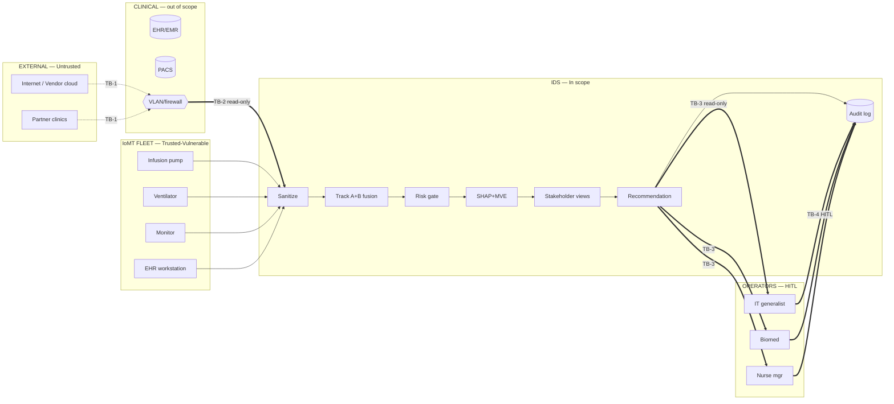

# Threat Model — XAI-IDS-Healthcare

> Foundation document for all RQs. Companion artifact: [`docs/figures/trust_boundaries.png`](figures/trust_boundaries.png) (Mermaid source: [`docs/figures/trust_boundaries.mmd`](figures/trust_boundaries.mmd)).

Generated: 2026-05-05 · Branch: `fix/shap-category-vocab`

---

## 1. System Overview

### 1.1 Purpose and scope

The XAI-IDS-Healthcare prototype is a **detection + explanation + recommendation** layer for IoMT-heavy mid-sized hospitals (200–500 beds). It produces *recommendations* for an IT generalist; it does not enforce, configure, or modify any clinical or network device. Trust-boundary placement (see figure):

| Boundary | What crosses it | Read/Write |
|---|---|---|
| **TB-1** Internet / Vendor cloud → VLAN/firewall | inbound flows, vendor sync | out of scope |
| **TB-2** VLAN/firewall → IDS Sanitize | mirrored network flows (25 features) | **read-only** |
| **TB-3** IDS Response recommendation → Operators | rendered MVE alert | **read-only display** |
| **TB-4** Operators → Audit log | operator decision metadata | append-only write |

### 1.2 In scope (this prototype owns these components)

| Component | Code path | RQ coverage |
|---|---|---|
| Feature sanitizer | [`src/preprocessing.py`](../src/preprocessing.py) | RQ1.b, EA-06 |
| Track A detector (XGB / RF / DT) | [`module2_detection/`](../module2_detection/) | RQ1.a |
| Track B novelty (DAE) | [`module2_detection/models/DAE.py`](../module2_detection/models/DAE.py) | RQ1.b |
| Two-stage fusion + risk score | [`module3_risk_scoring/`](../module3_risk_scoring/) | RQ2 |
| Risk-adaptive gate | [`src/risk_scorer.py`](../src/risk_scorer.py) | RQ2 |
| SHAP explainer | [`module4_explanations/module4_online_explainer.py`](../module4_explanations/module4_online_explainer.py) | RQ3 |
| MVE generator (3-layer) | [`src/mve_generator.py`](../src/mve_generator.py) | RQ3, RQ4 |
| Stakeholder views + tier recommendation | [`module5_responses/`](../module5_responses/) | RQ4 |
| Dashboard + audit | [`module6_evaluation/module6_app.py`](../module6_evaluation/module6_app.py) | RQ4, RQ5 |

### 1.3 Out of scope (assumed-trusted or assumed-handled elsewhere)

- **EHR / EMR system of record**, **PACS**, lab systems — protected by hospital perimeter.
- **VLAN, firewall, switch fabric** — handled by network/security infrastructure team.
- **Physical security** of devices — facility responsibility.
- **Identity / authn / authz** — hospital SSO assumed; this prototype does not authenticate.
- **Pre-deployment supply-chain integrity** of devices — assumed via procurement.
- **Patient-data lifecycle** outside the network flow — encryption at rest, retention, etc., are EHR responsibilities.

### 1.4 Trust boundaries (Mermaid)

A rendered version is at [`docs/figures/trust_boundaries.png`](figures/trust_boundaries.png).

---

## 2. Assets

### 2.1 Primary assets — patient-impacting

| Asset | Why it matters | Worst-case loss |
|---|---|---|
| **Patient data (PHI)** in transit and at rest on devices | HIPAA-regulated; identity theft fuel | Mass exfiltration → ransomware leverage; identity loss; regulatory penalty |
| **Medical devices** (infusion pumps, ventilators, monitors) | Direct patient-care function | Patient harm from manipulated dosing, false vitals, denied therapy |
| **Clinical workflows** (continuity of care) | Operations depend on device + EHR availability | Care delay; emergency diversion; safety incident |

### 2.2 Secondary assets — system-impacting

| Asset | Why it matters | Worst-case loss |
|---|---|---|
| Detection model artifacts (XGB / RF / DT / DAE) | If extracted, attacker can craft inputs that evade them | Detection blind spot; bypass of all downstream MVE/risk logic |
| SHAP explanations | If poisoned or unstable, mislead operator triage | Wrong actions taken; operator trust erosion |
| Audit logs | Forensic + regulatory record | Repudiation, regulatory non-compliance |
| Operator credentials | Authn boundary into dashboard + EHR | Lateral access; alert silencing |

---

## 3. Attacker Model

### 3.1 Capabilities considered

| ID | Capability | Notes |
|---|---|---|
| **A1** | Network attacker (passive observer) | Can sniff mirrored traffic outside the IDS boundary |
| **A2** | Network attacker (active MITM) | Can modify in-flight traffic between IoMT device and aggregator |
| **A3** | Compromised device (insider on the wire) | Has credentials of one IoMT device or workstation |
| **A4** | Compromised vendor (supply chain post-deployment) | Pushes a malicious firmware update |
| **A5** | Sophisticated APT | A1–A4 combined, with patience and bespoke tooling |

### 3.2 Attacker goals

1. **Patient harm** via device manipulation (dose change, false reading, therapy denial).
2. **PHI exfiltration** for ransom / black-market sale.
3. **Ransomware staging** (lateral movement, encryption preparation).
4. **Availability disruption** (block care delivery; pressure for ransom payment).
5. **Plausible deniability** (use legitimate-looking traffic to delay detection).

### 3.3 Out of scope (explicitly accepted)

- **Physical attacks on devices** (theft, tampering with sensors).
- **Social engineering** of clinical staff to obtain credentials.
- **Pre-deployment supply chain compromise** (device shipped already malicious).
- **Side-channel attacks** on the dashboard host (Spectre, etc.).
- **Sub-network adversaries below the flow-export point** (the IDS sees what the switch mirrors; what the switch never sees, the IDS cannot defend).

---

## 4. Threats — STRIDE (IoMT-contextualised)

Threat IDs use the convention `T-{S|T|R|I|D|E}{n}`. Each threat lists the attacker capability that enables it (A1–A5).

### 4.1 Spoofing

| ID | Threat | Enabled by |
|---|---|---|
| **T-S1** | Device impersonation — rogue device joins fleet, mimics legitimate flow profile | A1, A3 |
| **T-S2** | Credential abuse — stolen IT-generalist or biomed credentials used to silence alerts via the dashboard | A2, A3 |
| **T-S3** | Source-IP spoofing — attacker forges flow source to appear as a known infusion pump | A1, A2 |

### 4.2 Tampering

| ID | Threat | Enabled by |
|---|---|---|
| **T-T1** | Data alteration in transit — PHI fields modified mid-flow | A2 |
| **T-T2** | Detection-model evasion — adversarial perturbation of network features to keep `c_detect` below threshold | A1 (with model knowledge), A5 |
| **T-T3** | Audit-log tampering — attacker inside dashboard host edits or deletes records | A3, A5 |
| **T-T4** | Sanitiser injection (EA-06) — NaN/Inf-bombing inputs to mask anomalies via fallback imputation | A2, A3 |

### 4.3 Repudiation

| ID | Threat | Enabled by |
|---|---|---|
| **T-R1** | Operator denies action taken (e.g. "I never approved the isolation") | A3 (insider) |
| **T-R2** | System denies an alert was generated for forensic review | A3, A5 |

### 4.4 Information disclosure

| ID | Threat | Enabled by |
|---|---|---|
| **T-I1** | PHI exfiltration via outbound traffic that appears benign to detector | A1, A3 |
| **T-I2** | Threat-intelligence leak — attacker probes the system to learn detection thresholds (`P_XGB_HIGH_CONF=0.85`, DAE 95th-percentile) and crafts inputs just below | A1, A5 |
| **T-I3** | SHAP feature leakage — explanations reveal which network features matter, helping evasion | A1, A5 |

### 4.5 Denial of service

| ID | Threat | Enabled by |
|---|---|---|
| **T-D1** | Detection-model overload — alert flood overwhelms inference loop | A1, A2 |
| **T-D2** | Device network saturation — IoMT devices cut off from monitoring server | A1, A2 |
| **T-D3** | Operator alert fatigue — slow-burn flood of low-severity alerts to numb operator into ignoring real one | A5 |

### 4.6 Elevation of privilege

| ID | Threat | Enabled by |
|---|---|---|
| **T-E1** | Lateral movement — compromised IoMT device pivots to clinical systems | A3, A5 |
| **T-E2** | Privilege escalation via unpatchable device CVE | A3, A5 |
| **T-E3** | Operator-account hijack escalates to "no-alert" suppression (override of safety floor) | A3 |

---

## 5. MITRE ATT&CK Mapping

Mapping the 5 designed alert categories to ATT&CK techniques. The detection layer's job is to surface technique-level evidence; the MVE quotes the technique ID for analyst grounding.

| Alert category | ATT&CK technique | ID | Detection signal |
|---|---|---|---|
| `unauthorized_ehr_access` | Valid Accounts | **T1078** | Track A flag on access-velocity / department-scope features |
| `data_alteration` | Data Manipulation | **T1565** | Track A flag on data-volume + biometric features (matched 100% in WUSTL test set) |
| `data_alteration` (stored variant) | Stored Data Manipulation | **T1565.001** | Same signature plus low DAE reconstruction error on raw features only |
| `anomalous_outbound` | Application Layer Protocol | **T1071** | Track A on dest-IP / port; SHAP top-feature `network_destination` |
| `lateral_movement` | Remote Services | **T1021** | Track B novelty on inter-VLAN flow patterns |
| `data_exfiltration` | Exfiltration over C2 | **T1041** | Track A on `data_volume` + `network_destination` group elevation |
| Adversarial input | Virtualization / Sandbox Evasion | **T1497** | Sanitiser DEGRADED flag (EA-06 mitigation) |

The mapping is consumed by the MVE Layer 1 generator, which can include the technique ID in the rendered alert (e.g. *"Pattern matches T1071 (C2 communication). XGBoost: 92%."*).

---

## 6. Threat → Mitigation Matrix

Every threat above has either a **Mitigation** column (with the code or invariant that addresses it) or an explicit **Accepted** marker (with rationale). No silent gaps.

| Threat | Status | Mitigation / Acceptance | Reference |
|---|---|---|---|
| **T-S1** Device impersonation | Mitigated | DAE novelty detection on cascaded `[raw \|\| P_xgb, P_rf, P_dt]` flags rogue devices whose joint profile is far from the benign training distribution | [`module2_detection/models/DAE.py`](../module2_detection/models/DAE.py); ARCHITECTURE.md Step [6b] |
| **T-S2** Credential abuse | Partial / accepted | Authn is out of scope; system invariant: dashboard cannot silence the safety floor (CRITICAL+unpatchable always surfaces) | [`src/risk_scorer.py:155-156`](../src/risk_scorer.py#L155); `tests/test_safe_failure.py::test_critical_unpatchable_surfaces_in_maintenance_window` |
| **T-S3** Source-IP spoofing | Mitigated (defence-in-depth) | Track A behavioural baseline trips on spoofed flows whose timing/load profile diverges from the impersonated device | `risk_report.dual_track_fusion.quadrants` (XGBoost flagged 299/337 spoofing attacks on test set) |
| **T-T1** Data-alteration in transit | Accepted (out of scope) | TLS / link-layer integrity is hospital-network responsibility; T-T1 detected post-hoc by the `data_alteration` alert category (FNR=0.0 on test set) | RQ1.a baseline |
| **T-T2** Detection-model evasion | Mitigated | Two-stage fusion: even when adversarial perturbation pushes `P_xgb < a_low`, DAE elevation (`only_dae` quadrant) catches it. **INVARIANT 1** — DAE only elevates, never suppresses | [`module3_risk_scoring/module3_risk_scores.py::compute_c_detect`](../module3_risk_scoring/module3_risk_scores.py); ARCHITECTURE.md Step [7] |
| **T-T3** Audit-log tampering | Mitigated (operational) | Append-only audit log; production deployment must route to a write-once SIEM. **INVARIANT 4** — Audit trail complete | ARCHITECTURE.md Step [16] |
| **T-T4** Sanitiser injection (EA-06) | Mitigated | Per-feature **BENIGN_MEDIANS** replacement (not 0.0); DEGRADED flag elevates anomaly score ×1.20; FAILED clamps score ≥ 0.95 | [`src/preprocessing.py`](../src/preprocessing.py); `results/reports/feature_sanitization.yaml`; `tests/test_feature_sanitization.py` (7 tests) |
| **T-R1** Operator action denial | Mitigated | Step [16] logs operator_id, action, timestamp, rationale per alert | ARCHITECTURE.md Step [16] |
| **T-R2** System denies alert | Mitigated | Suppressed alerts also written to audit log (read-only forensic trail) | ARCHITECTURE.md Step [10] suppression branch |
| **T-I1** PHI exfiltration | Mitigated | `data_exfiltration` alert category (T1041); two-stage fusion catches 4-of-5 designed categories. Residual: see §7 small-sample CI on FNR_CRITICAL | `results/reports/detection_baseline.yaml` |
| **T-I2** Threshold reconnaissance | Partial / accepted | Thresholds are static and findable from this repo. Mitigation: production deployment should rotate `P_XGB_HIGH_CONF` and DAE percentile via `module2_detection/tuning/` and treat them as secrets. Today: documented as residual risk | [`src/data_models.py::P_XGB_HIGH_CONF`](../src/data_models.py); §7 |
| **T-I3** SHAP feature leakage | Mitigated | MVE Layer 1 emits feature *categories* (e.g. `timing_pattern`) and clinician-readable narratives, not raw `DIntPkt` magnitudes. **INVARIANT 5** — Layer 1 references SHAP top features but no raw values | [`module4_explanations/module4_online_explainer.py`](../module4_explanations/module4_online_explainer.py); `tests/negative_tests.py::test_no_model_internals_exposed` |
| **T-D1** Model overload | Partial | Per-process model registry with `lru_cache` keeps inference O(1); per-alert latency budget 150 ms. No rate-limiting today; documented gap | [`common/model_registry.py`](../common/model_registry.py) |
| **T-D2** Device network saturation | Accepted (out of scope) | Network-infrastructure responsibility | §1.3 |
| **T-D3** Alert fatigue | Mitigated | Risk-adaptive gate suppresses LOW alerts under similar-events>5 rule; tier-recommendation routes only `NOVEL_ANOMALY` to L2 specialist; `should_surface=False` for benign quadrant | ARCHITECTURE.md Step [10]; M5 user-study Mann-Whitney result (p=0.00019) |
| **T-E1** Lateral movement | Mitigated (detection only) | `lateral_movement` alert category exists and is tracked; surfacing is the only response (no auto-block). Production blocking is hospital-firewall responsibility | ARCHITECTURE.md Step [15]; `tests/negative_tests.py::test_no_automated_blocking` |
| **T-E2** Privilege escalation via unpatchable CVE | Compensating-control | The IDS is the **only** compensating control for unpatchable devices — that's why CRITICAL+unpatchable has the safety floor | [`src/risk_scorer.py:155`](../src/risk_scorer.py#L155); §8 |
| **T-E3** Operator hijack → "no-alert" override | Mitigated | Safety floor is enforced inside `score_alert()`; cannot be turned off through any dashboard control. **INVARIANT 2** — Safety floor holds on all paths including maintenance window | `tests/test_safe_failure.py::test_critical_unpatchable_surfaces_in_maintenance_window` |

---

## 7. Residual Risks (Accepted)

The following risks are documented and accepted at the prototype phase. Each must be revisited before production deployment.

| Risk | Why accepted | Watch / revisit at |
|---|---|---|
| **Physical device attacks** | Out of scope; facility security responsibility | N/A |
| **Pre-deployment supply chain** | Out of scope; procurement responsibility | N/A |
| **Slow-burn attacks below detection threshold** | T-D3 mitigation reduces noise but does not eliminate sub-threshold persistence; documented in research limitations | Phase-3 longitudinal field deployment (RQ5) |
| **Model-extraction attack via probing** | An attacker who can submit known inputs and observe surfacing decisions can infer thresholds; mitigation requires rate-limiting + secret thresholds | Production deployment |
| **Small-sample CI on FNR_CRITICAL (N=48)** | Stratified eval set deliverable (P0.4) not yet met; CI half-width (0.073) wider than the point estimate | `Performance_baselines.md` GAP-PB-4 |
| **3 of 5 attack categories absent in WUSTL** | `lateral_movement`, `data_exfiltration`, `unauthorized_access` have zero samples in the public dataset; FNR for them is undefined today | GAP-PB-5; Phase-2 synthetic augmentation |
| **No live threat-intel feed** | Step [8] threat-intel mapping is rule-based (static `attack_category → ATT&CK` lookup) | Production: integrate MISP / TAXII feed |
| **Static fusion thresholds** | `P_XGB_HIGH_CONF=0.85` is a single tuned constant; an adversary who reads this repo knows it | T-I2 above; production: per-deployment recalibration |

---

## 8. IoMT-Specific Concerns

### 8.1 Legacy and unpatchable devices

Mid-sized hospitals operate fleets where a non-trivial fraction of life-sustaining equipment cannot receive security patches (unsupported OSes, FDA-recertification cost, 10–15 year service life). For these devices the IDS is the **only** compensating control — anything the IDS misses, no other layer catches.

Implications encoded in the design:

- **Safety floor** ([`src/risk_scorer.py:155`](../src/risk_scorer.py#L155)): `criticality == "CRITICAL" and not patchable` → `should_surface = True` regardless of other rules. Holds on all code paths including the maintenance-window early return.
- **Threshold reduction**: `_THRESHOLD_MULT[("CRITICAL", False)] = 0.70` — a CRITICAL+unpatchable device's threshold is **30% lower** (0.50 × 0.70 = 0.35), making the IDS more sensitive to weak signals where the consequence is highest.
- **Track B (DAE) primary value**: novelty detection works without firmware updates, malware signatures, or patch backports — exactly what unpatchable devices need.

### 8.2 Clinical safety primacy

The system is built on a hard rule: **any detection action MUST NOT cause clinical disruption**.

| Mechanism | Where |
|---|---|
| **NO AUTO-EXECUTION** invariant — every action is a string recommendation only | ARCHITECTURE.md Step [15]; `tests/negative_tests.py::test_no_automated_blocking` |
| **DO NOT constraints** in MVE Layer 3 — explicit prohibition wording on CRITICAL alerts (e.g. *"DO NOT power off ventilator. Switch-port block is SAFE."*) | [`src/mve_generator.py:618-621`](../src/mve_generator.py#L618); `tests/acceptance_tests.py::test_clinical_constraint_awareness` (M4) |
| **Stakeholder-scoped actions** — IT generalist sees network actions; biomed sees device actions; nurse manager sees clinical actions. **INVARIANT 6** — each role only authorises role-appropriate actions | ARCHITECTURE.md Step [13] |
| **Maintenance window suppresses display, NOT detection** — alerts during scheduled maintenance are recorded but not paged; CRITICAL+unpatchable is exempt from this suppression | ARCHITECTURE.md Step [10]; `tests/test_safe_failure.py::test_critical_unpatchable_surfaces_in_maintenance_window` |
| **Recommendation-only audit trail** — operator decision is the only authoritative state-changing event | Step [16] |

---

## Appendix A — Acceptance-criteria checklist

| Criterion | Status | Evidence |
|---|---|---|
| All 8 sections complete | PASS | §1 – §8 above |
| STRIDE coverage for IoMT context | PASS | §4 — 17 threats spanning all six STRIDE classes (S/T/R/I/D/E) |
| MITRE ATT&CK mapping for ≥5 alert categories | PASS | §5 — 7 mappings across 5 categories + adversarial input |
| Each threat traces to mitigation OR explicit acceptance | PASS | §6 — 17/17 threats have a row in the mitigation matrix; accepted ones cite §7 |
| Trust boundary diagram renders | PASS | [`docs/figures/trust_boundaries.png`](figures/trust_boundaries.png) (2280×1497, 8-bit PNG); Mermaid source [`docs/figures/trust_boundaries.mmd`](figures/trust_boundaries.mmd); inline Mermaid in §1.4 |

## Appendix B — Cross-references

- Implementation status of each pipeline step: `ARCHITECTURE.md` § *Workflow step → code map*
- Detection-baseline metrics with Wilson CIs: `results/reports/detection_baseline.yaml`
- Sanitiser contract + EA-06 acceptance tests: `results/reports/feature_sanitization.yaml`, `tests/test_feature_sanitization.py`
- Safety-floor + maintenance-window invariant tests: `tests/test_safe_failure.py`
- Negative tests guarding the no-auto-execution and no-internals-leak invariants: `tests/negative_tests.py`
